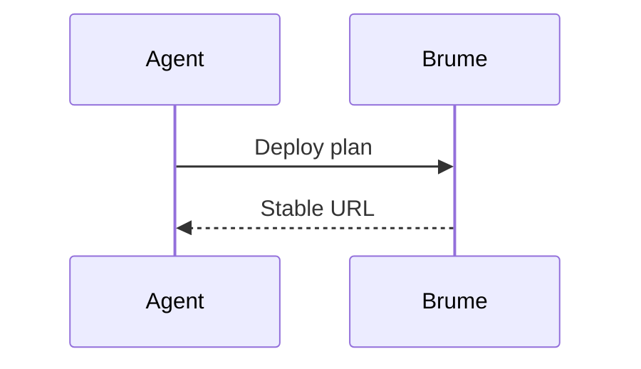

# Brume Example Plan

This fixture proves that regular Markdown and safe MDX components render together.

<Callout type="info" title="Local renderer">
The page was generated before it was uploaded to Brume.
</Callout>

## Delivery flow

<Steps>
  <Step title="Build the plan">Compile Markdown and MDX into HTML.</Step>
  <Step title="Publish the bundle">Upload the validated artifact.</Step>
</Steps>



## Code

```rust
fn main() {
    println!("hello from Brume");
}
```

Read the [architecture page](./architecture.md).

